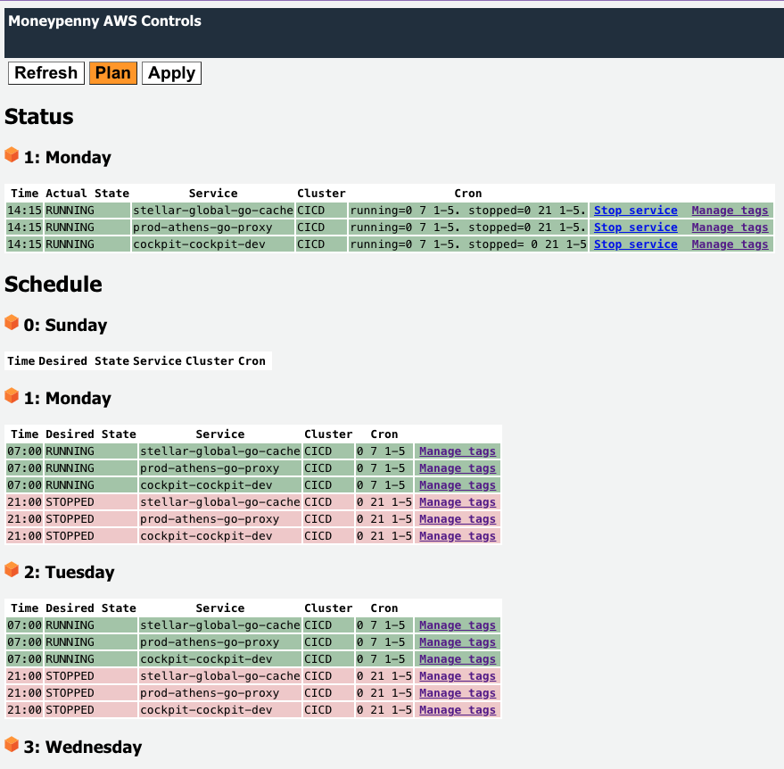
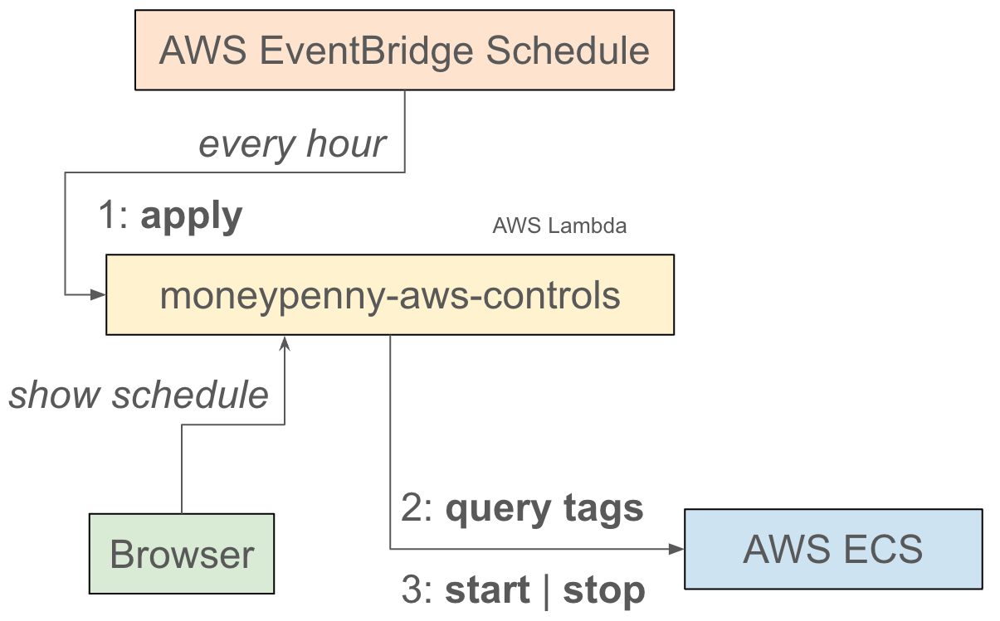

## moneypenny AWS controls

Moneypenny AWS Controls offers a scheduling service specifically designed for the management of ECS Fargate services. It skillfully manipulates the `desired-count` value to enable the halting of operations for these services during times of inactivity, particularly during non-business hours (evenings, and weekends) and chiefly in non-production environments (dev, test, acc). The main goal of the Moneypenny AWS Controls project is to optimize resource usage, thereby contributing to the reduction of AWS expenses.




## Considerations

There are some vital pointers to consider while using these controls:
* The service could potentially face conflicts with infrastructural management tools such as Terraform, especially during scheduled stops. E.g. applying a terraform plan could restart a service which was scheduled by `moneypenny-aws-controls` to be stopped.
* The service provides optional specifics for task number (`count`) at service start, which could differ from the count at service stop.
* Any updates to the `moneypenny` tag value might not instantly apply based on your AWS EventBridge Schedule cron expression. However, a manual `plan` and `apply` of the schedule could be done as an alternative.
* It is worth noting that AWS Fargate capacity providers differ as they control the number of tasks running through Auto Scaling Group connected to CloudWatch metrics and only operate at the cluster level. The `moneypenny-aws-controls` service, on the other hand, is purpose-built for controlling the uptime and downtime with precision.


## cron

Each state change (->running, ->stopped) requires a simplified cron expression.
```
 0 15 1-5
 ```

 - minute, 0..59
 - hour, 0..23
 - day of week, use range "2-3" or slash separated values "1/2/3/4". Sunday=0

### AWS tag

Using a tag with key `moneypenny`, you can specify the cron expressions for both `running` and `stopped` state changes.
Append a dot `.` to separate each statement (running,stopped,count).

To run a service between 08:00 and 18:00 on workdays (1=Monday,5=Friday), use:
```
running=0 8 1-5. stopped=0 18 1-5.
```

To stop a service indefinitely, use:
```
stopped=0 0 0-6.
```

To run a service indefinitely either remove, empty, comment the tag or use:
```
running=0 0 0-6.
```

To disable one or all state changes, use the comment indicator `//`:
```
// running=0 8 1-5. stopped=0 18 1-5. count=4
running=0 8 1-5. // stopped=0 18 1-5. count=4
```

Run `schedule` or `plan` to see the planned effect.

### Sharing an AWS tag

The value of the `moneypenny` tag can also refer to the tag value of another service using the `@` prefix:
```
@other-service
```
This expression means "use the value of the `moneypenny` tag as specified by `other-service` (for now, only within the same cluster).

### Local run

You can run the program `awscontrols` on your local machine to `plan`, `report` and `apply` the schedule without AWS deployment.
The program will scan all services of all clusters for the active AWS profile.

Alternatively, you can run the program using a local defined services-plan file:
```
awscontrols -local -debug -plans aws-service-plans.json plan
```

### Local config

Next to or instead of using resource tags, you can use the program by specifying a `aws-service-plans.json` file. 
Local and enabled defined plans override the onces defined (through the `moneypenny` tag) in AWS.

```
[
    { 
        "service-arn": "arn:aws:ecs:eu-central-1:9111111:service/cluster/name",
        "moneypenny": "running=0 8 1-5. stopped=0 18 1-5."
    },
    { 
        "service-arn": "arn:aws:ecs:eu-central-1:9111111:service/cluster/ignore",
        "moneypenny": "running=0 8 1-5. stopped=0 18 1-5.",
        "disabled": true
    },
    { 
        "service-arn": "arn:aws:ecs:eu-central-1:9111111:service/cluster/high-load",
        "moneypenny": "running=0 7 1-5. stopped=0 22 1-5. count=2."
    }
]
```
To run the plan:
```
awscontrols -plans aws-service-plans.json
```
To run apply the plan:
```
awscontrols -plans aws-service-plans.json apply
```
To generate the schedule:
```
awscontrols -plans aws-service-plans.json schedule
```

### AWS deployment

`moneypenny-aws-controls` is deployed as a AWS Lambda service that is invoked by the AWS EventBridge Scheduler or by your Browser.
Access from the Browser requires Basic Authentication ; because of the Browser access requirement, AWS IAM cannot be used.
The credentials need to be provided as environment variable values upon deployment.

There are ways to deploy this service:

- [AWS CDK](cdk/moneypenny/README.md)
- [AWS Console](AWS_console.md)

### Terraform

Optionally, you can tell terraform not to touch the `moneypenny` tag value for ECS services by including a life-cycle section:
```
resource "aws_ecs_service" "default" {

  # ... other stuff

  lifecycle { 
    ignore_changes = [
      tags["moneypenny"],
    ]
  }
}
```

### Troubleshooting

For AWS Lambda deployment, you can add the URL query parameter `debug=true` to view more details in the logging.
For running the `awscontrols` program, you can add the `-debug` flag to view more details in the logging.

### How it works

