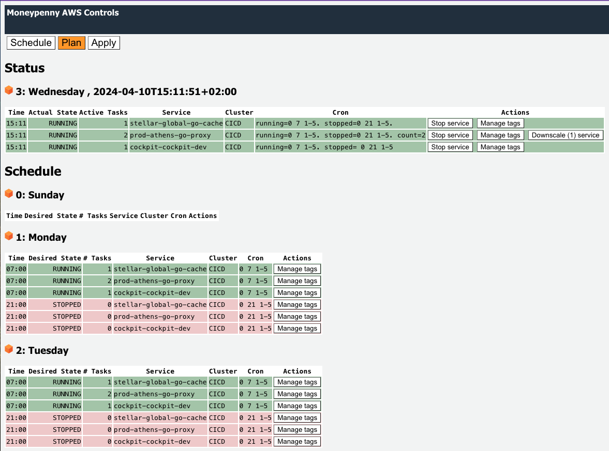

## moneypenny AWS controls

Service to schedule ECS Fargate services by controlling the `desired-count` value.
The primary purpose is to halt the operations of services during off-business hours (evenings, weekends), specifically for non-production environments (dev, test, acc), resulting in a reduction of AWS expenses.




## Considerations

- If you use tools such as `Terraform` to manage your infrastructure then these tools can conflict with this schedule; e.g. applying a terraform plan when services are stopped by `moneypenny-aws-controls` could start these services again and vice versa.
- The schedule can optionally specifiy the number of tasks to run (`count`) when starting the service; this may not be same count at the time the service was stopped.
- Depending on your AWS EventBridge Schedule cron expression, updates to a `moneypenny` tag value is not immediately effective; you can manually `plan` and `apply` the schedule instead.
- AWS Fargate capacity providers is a different solution to control the number of tasks running and uses an Auto Scaling Group connected to CloudWatch metrics and only works on the cluster level. The `moneypenny-aws-controls` service is for exact controlling up and downtime of services.


## cron

Each state change (->running, ->stopped) requires a simplified cron expression.
```
 0 15 1-5
 ```

 - minute, 0..59
 - hour, 0..23
 - day of week, use range "2-3" or slash separated values "1/2/3/4". Sunday=0

### AWS tag

Using a tag with key `moneypenny`, you can specify the cron expressions for both `running` and `stopped` state changes.
Append a dot `.` to separate each statement (running,stopped,count).

To run a service between 08:00 and 18:00 on workdays (1=Monday,5=Friday), use:
```
running=0 8 1-5. stopped=0 18 1-5.
```

To stop a service indefinitely, use:
```
stopped=0 0 0-6.
```

To run a service indefinitely either remove, empty, comment the tag or use:
```
running=0 0 0-6.
```

To disable one or all state changes, use the comment indicator `//`:
```
// running=0 8 1-5. stopped=0 18 1-5. count=4
running=0 8 1-5. // stopped=0 18 1-5. count=4
```

Run `schedule` or `plan` to see the planned effect.

### Sharing an AWS tag

The value of the `moneypenny` tag can also refer to the tag value of another service using the `@` prefix:
```
@other-service
```
This exression means "use the value of the `moneypenny` tag as specified by `other-service` (for now, only within the same cluster).

### Local run

You can run the program `awscontrols` on your local machine to `plan`, `report` and `apply` the schedule without AWS deployment.
The program will scan all services of all clusters for the active AWS profile (or as specified by `-profile`).

Alternatively, you can run the program using a local defined services-plan file:
```
awscontrols -local -debug -plans aws-service-plans.json plan
```

### AWS deployment

`moneypenny-aws-controls` is deployed as a AWS Lambda service that is invoked by the AWS EventBridge Scheduler or by your Browser.
Access from the Browser requires Basic Authentication ; because of the Browser access requirement, AWS IAM cannot be used.
The credentials need to be provided as environment variable values upon deployment.
Goto the folder `lambda` to find scripts and resources for deployment.

#### create IAM Policy

Create a policy named `moneypenny-aws-controls-policy` using permissions as defined in `iam-policy.json`.

#### create IAM Role

Create a role named `moneypenny-aws-controls-role`:

- Trusted entity type = AWS Service
- Use case, Service = Lambda
- Policy = `moneypenny-aws-controls-policy`

#### deploy Lambda service (ARM64)

The `Makefile` has a `TIME_ZONE` environment variable you might need to change.
In the commands below, replace the ROLE arn with that of `moneypenny-aws-controls-role` you just created.
Also, replace the USER and PASSWORD values.

```
make compile 
make zip
BASIC_USER=myuser BASIC_PASSWORD=mypwd ROLE=arn:aws:iam::111111111:role/moneypenny-aws-controls-role make create
```

#### add trigger for Lambda service (API Gateway)

- create a new API Gateway HTTP API

Now you have an API endpoint that you can visit to see the current Schedule.

#### define apply schedule

Using the Amazon EventBridge Scheduler you define a new schedule that targets the service.

- create a new schedule called `apply-hourly-moneypenny-aws-controls`
- set the cron expression to `5 * * * ? *` , which means run 5 minutes past every hour
- set the target to the Lambda `moneypenny-aws-controls`
- set the payload to:
```
{
    "queryStringParameters":{
        "do":"apply"
    }
}
```
- change the role name to `Amazon_EventBridge_Scheduler_LAMBDA_moneypenny_aws_controls` for better recognition when listing roles in AWS console.

### Local config

Next to or instead of using resource tags, you can use the program by specifying a `aws-service-plans.json` file. 
Local and enabled defined plans override the onces defined (through the `moneypenny` tag) in AWS.

```
[
    { 
        "service-arn": "arn:aws:ecs:eu-central-1:9111111:service/cluster/name",
        "moneypenny": "running=0 8 1-5. stopped=0 18 1-5."
    },
    { 
        "service-arn": "arn:aws:ecs:eu-central-1:9111111:service/cluster/ignore",
        "moneypenny": "running=0 8 1-5. stopped=0 18 1-5.",
        "disabled": true
    },
    { 
        "service-arn": "arn:aws:ecs:eu-central-1:9111111:service/cluster/high-load",
        "moneypenny": "running=0 7 1-5. stopped=0 22 1-5. count=2."
    }
]
```
To run the plan:
```
awscontrols -plans aws-service-plans.json
```
To run apply the plan:
```
awscontrols -plans aws-service-plans.json apply
```
To generate the schedule:
```
awscontrols -plans aws-service-plans.json schedule
```

### Terraform

Optionally, you can tell terraform not to touch the `moneypenny` tag value for ECS services by including a life-cycle section:
```
resource "aws_ecs_service" "default" {

  # ... other stuff

  lifecycle { 
    ignore_changes = [
      tags["moneypenny"],
    ]
  }
}
```

### Troubleshooting

For AWS Lambda deployment, you can add the URL query parameter `debug=true` to view more details in the logging.
For running the `awscontrols` program, you can add the `-debug` flag to view more details in the logging.

### How it works

